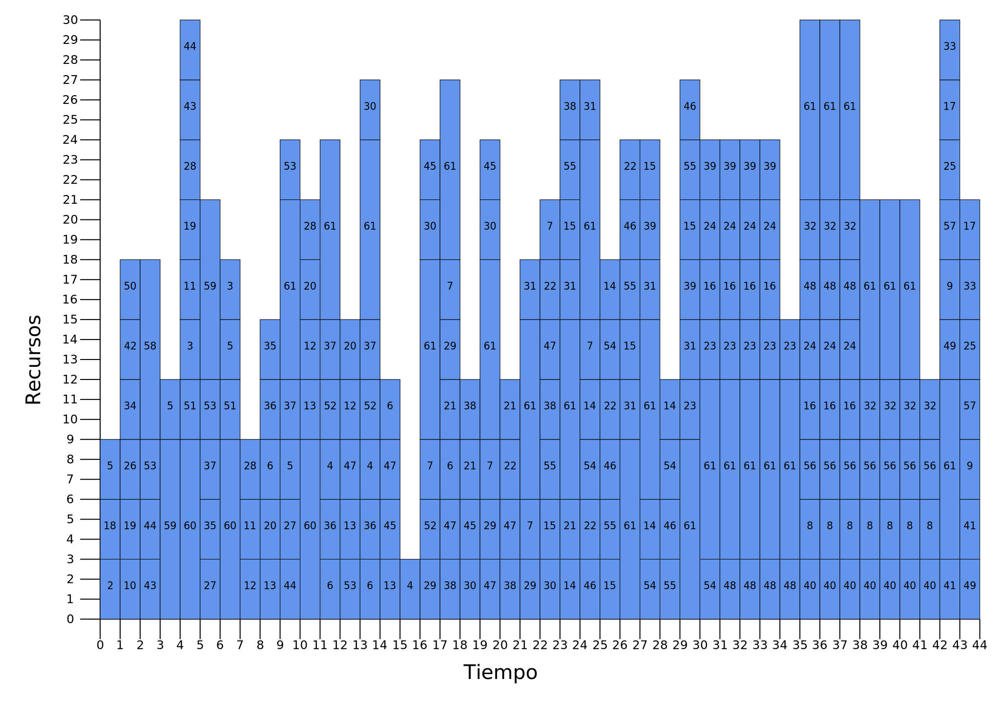

# ts-sa-prcpsp
Tabu Search and Simulated Annealing for PRCPSP (Pre-emptive Resource-Constrained Project Scheduling Problem)

### Dependencies
* Rust v1.5
* Cargo v1.5

### Build
```bash
cargo build --release
```

### Input
A example file for create an optimal solution with parameters, each one in a line:

`seed` : Seed for pseudo-random numbers.

`random_cost` : Optimal cost.

`random_activities` : Number of activities.

`random_resources` : Number of resources.

`random_resources_total_capacity` : Total sum of resources capacity.

See `examples` dir. 

### Run

#### Tabu Search

```bash
cargo run --release TS <file> <seed> <m> <tabu_time> <neighbors> <iterations>
```
Where:

`file` : Path to file with input.

`seed` : Seed for pseudo-random numbers.

`m` : Number of interrumptions.

`tabu_time` : Tabu time.

`neighbors` : Number of neighbors to explore.

`iterations` : Number of iterations to reach.

#### Simulated Annealing

```bash
cargo run --release SA <file> <seed> <m> <neighbors> <temperature> <decrement> <epsilon>
```
Where:

`file` : Path to file with input.

`seed` : Seed for pseudo-random numbers.

`m` : Number of interrumptions.

`neighbors` : Number of neighbors to explore.

`temperature` : Temperature.

`decrement` : Decrement percent.

`epsilon` : Minimum temperature to reach.

### Example

Using Tabu Search for an example of 80 activities in `examples\prcpsp-80.txt` file.

```bash
cargo run --release TS examples\prcpsp-80.txt 55 2 29 19 350
```

### Output 

Initial, optimal and best solution found in SVG files in `output` dir.

Initial (trivial) solution in `initial.svg` 
<div class="col-md-offset">
  
</div>

Best solution found in `best.svg`
<div class="col-md-offset">
  
</div>

Optimum solution constructed in `optimum.svg`
<div class="col-md-offset">
  
</div>

Log file in `log` dir.
<div class="col-md-offset">
  
</div>

### Test
```bash
cargo test 
```
