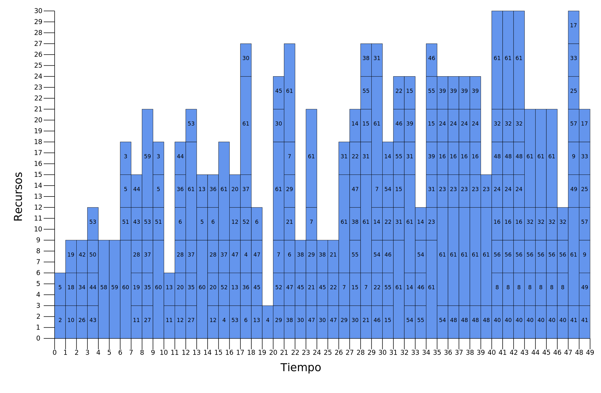

# ts-sa-prcpsp
Tabu Search and Simulated Annealing for PRCPSP (Pre-emptive Resource-Constrained Project Scheduling Problem)

### Dependencies
* Rust v1.5
* Cargo v1.5

### Build
```bash
cargo build --release
```

### Run
```bash
cargo run --release
```
### Output 

Initial, optimal and best solution found in SVG files in `output` dir.

Initial (trivial) solution in `initial.svg` 
<div class="col-md-offset">
  
</div>

Best solution found in `best.svg`
<div class="col-md-offset">
  
</div>

Optimum solution constructed in `optimum.svg`
<div class="col-md-offset">
  
</div>

Log file in `log` dir.
<div class="col-md-offset">
  
</div>

### Test
```bash
cargo test 
```
